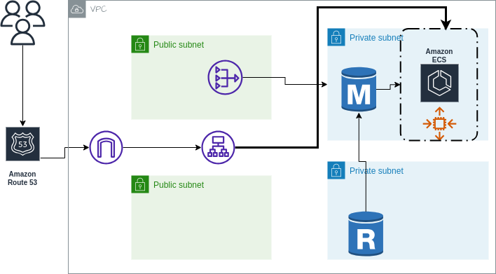

# AWS Infrastructure Deployment - API Platform

This Terraform script deploys the necessary infrastructure components on Ecs cluster to set up an API platform using AWS resources.

## Usage

1. Clone this repository to your local machine.
2. Navigate to the cloned repository directory using the terminal.
3. Initialize Terraform with the command:
   ```bash
   terraform init
   ```
4. Review and modify the `variables.tf` file to adjust variables as needed.
5. Review and modify the `main.tf` file to ensure it reflects your desired architecture and configurations.
6. Run the following command to plan the deployment and see what resources will be created:
   ```bash
   terraform plan
   ```
7. If the plan looks correct, apply the changes with:
   ```bash
   terraform apply
   ```
8. Confirm the deployment by typing `yes` when prompted.
9. Wait for Terraform to provision the resources. Once completed, you will see the output showing the created resources.

## Components

The Terraform script creates the following AWS resources:

- Amazon Cognito User Pool and User Pool Client for user management.
- Virtual Private Cloud (VPC) with public and private subnets.
- Amazon RDS PostgreSQL instance for database storage.
- Amazon ECS Cluster for containerized application deployment.
- Amazon ECR repositories for frontend and backend Docker images.
- Amazon Load Balancer (ALB) for routing traffic.
- Route53 DNS records for the ALB.
- App Auto Scaling configuration to manage ECS service capacity.
- CloudWatch Alarms to monitor ECS service metrics.

## Cleanup

To clean up the deployed resources, run:
```bash
terraform destroy
```
## ArchitectureDiagram


## Requirements

| Name | Version |
|------|---------|
| <a name="requirement_terraform"></a> [terraform](#requirement\_terraform) | >= 1.0 |
| <a name="requirement_aws"></a> [aws](#requirement\_aws) | >= 4.9 |

## Providers

| Name | Version |
|------|---------|
| <a name="provider_aws"></a> [aws](#provider\_aws) | 5.13.0 |

## Modules

No modules.

## Requirements

| Name | Version |
|------|---------|
| <a name="requirement_terraform"></a> [terraform](#requirement\_terraform) | >= 1.0 |
| <a name="requirement_aws"></a> [aws](#requirement\_aws) | >= 4.9 |

## Providers

| Name | Version |
|------|---------|
| <a name="provider_aws"></a> [aws](#provider\_aws) | 5.13.0 |

## Modules

No modules.

## Resources

| Name | Type |
|------|------|
| [aws_acm_certificate.my_certificate](https://registry.terraform.io/providers/hashicorp/aws/latest/docs/resources/acm_certificate) | resource |
| [aws_acm_certificate_validation.my_certificate_validation](https://registry.terraform.io/providers/hashicorp/aws/latest/docs/resources/acm_certificate_validation) | resource |
| [aws_appautoscaling_policy.ecs_policy](https://registry.terraform.io/providers/hashicorp/aws/latest/docs/resources/appautoscaling_policy) | resource |
| [aws_appautoscaling_target.ecs_target](https://registry.terraform.io/providers/hashicorp/aws/latest/docs/resources/appautoscaling_target) | resource |
| [aws_cloudwatch_metric_alarm.ecs_cpu_alarm](https://registry.terraform.io/providers/hashicorp/aws/latest/docs/resources/cloudwatch_metric_alarm) | resource |
| [aws_cognito_user_pool.user_pool](https://registry.terraform.io/providers/hashicorp/aws/latest/docs/resources/cognito_user_pool) | resource |
| [aws_cognito_user_pool_client.client](https://registry.terraform.io/providers/hashicorp/aws/latest/docs/resources/cognito_user_pool_client) | resource |
| [aws_db_instance.rds_instance](https://registry.terraform.io/providers/hashicorp/aws/latest/docs/resources/db_instance) | resource |
| [aws_db_subnet_group.rds_subnet_group](https://registry.terraform.io/providers/hashicorp/aws/latest/docs/resources/db_subnet_group) | resource |
| [aws_ecs_cluster.ecs_cluster](https://registry.terraform.io/providers/hashicorp/aws/latest/docs/resources/ecs_cluster) | resource |
| [aws_ecs_service.api_service](https://registry.terraform.io/providers/hashicorp/aws/latest/docs/resources/ecs_service) | resource |
| [aws_ecs_task_definition.my_task](https://registry.terraform.io/providers/hashicorp/aws/latest/docs/resources/ecs_task_definition) | resource |
| [aws_eip.eip_a](https://registry.terraform.io/providers/hashicorp/aws/latest/docs/resources/eip) | resource |
| [aws_iam_policy.ecr_policy](https://registry.terraform.io/providers/hashicorp/aws/latest/docs/resources/iam_policy) | resource |
| [aws_iam_role.ecs_execution_role](https://registry.terraform.io/providers/hashicorp/aws/latest/docs/resources/iam_role) | resource |
| [aws_iam_role_policy_attachment.ecs_role_attachment](https://registry.terraform.io/providers/hashicorp/aws/latest/docs/resources/iam_role_policy_attachment) | resource |
| [aws_internet_gateway.igw](https://registry.terraform.io/providers/hashicorp/aws/latest/docs/resources/internet_gateway) | resource |
| [aws_lb.my_alb](https://registry.terraform.io/providers/hashicorp/aws/latest/docs/resources/lb) | resource |
| [aws_lb_listener.backend_listener](https://registry.terraform.io/providers/hashicorp/aws/latest/docs/resources/lb_listener) | resource |
| [aws_lb_listener.frontend_listener](https://registry.terraform.io/providers/hashicorp/aws/latest/docs/resources/lb_listener) | resource |
| [aws_lb_listener.http_listener](https://registry.terraform.io/providers/hashicorp/aws/latest/docs/resources/lb_listener) | resource |
| [aws_lb_listener.https_listener](https://registry.terraform.io/providers/hashicorp/aws/latest/docs/resources/lb_listener) | resource |
| [aws_lb_target_group.backend_tg](https://registry.terraform.io/providers/hashicorp/aws/latest/docs/resources/lb_target_group) | resource |
| [aws_lb_target_group.frontend_tg](https://registry.terraform.io/providers/hashicorp/aws/latest/docs/resources/lb_target_group) | resource |
| [aws_nat_gateway.nat_gateway](https://registry.terraform.io/providers/hashicorp/aws/latest/docs/resources/nat_gateway) | resource |
| [aws_route53_record.my_validation](https://registry.terraform.io/providers/hashicorp/aws/latest/docs/resources/route53_record) | resource |
| [aws_route53_record.subdomain](https://registry.terraform.io/providers/hashicorp/aws/latest/docs/resources/route53_record) | resource |
| [aws_route_table.private_route_table](https://registry.terraform.io/providers/hashicorp/aws/latest/docs/resources/route_table) | resource |
| [aws_route_table.public_route_table](https://registry.terraform.io/providers/hashicorp/aws/latest/docs/resources/route_table) | resource |
| [aws_route_table_association.private_association_a](https://registry.terraform.io/providers/hashicorp/aws/latest/docs/resources/route_table_association) | resource |
| [aws_route_table_association.private_association_b](https://registry.terraform.io/providers/hashicorp/aws/latest/docs/resources/route_table_association) | resource |
| [aws_route_table_association.public_association_a](https://registry.terraform.io/providers/hashicorp/aws/latest/docs/resources/route_table_association) | resource |
| [aws_route_table_association.public_association_b](https://registry.terraform.io/providers/hashicorp/aws/latest/docs/resources/route_table_association) | resource |
| [aws_security_group.alb_sg](https://registry.terraform.io/providers/hashicorp/aws/latest/docs/resources/security_group) | resource |
| [aws_security_group.ecs_sg](https://registry.terraform.io/providers/hashicorp/aws/latest/docs/resources/security_group) | resource |
| [aws_security_group.rds_sg](https://registry.terraform.io/providers/hashicorp/aws/latest/docs/resources/security_group) | resource |
| [aws_subnet.private_subnet_a](https://registry.terraform.io/providers/hashicorp/aws/latest/docs/resources/subnet) | resource |
| [aws_subnet.private_subnet_b](https://registry.terraform.io/providers/hashicorp/aws/latest/docs/resources/subnet) | resource |
| [aws_subnet.public_subnet_a](https://registry.terraform.io/providers/hashicorp/aws/latest/docs/resources/subnet) | resource |
| [aws_subnet.public_subnet_b](https://registry.terraform.io/providers/hashicorp/aws/latest/docs/resources/subnet) | resource |
| [aws_vpc.custom_vpc](https://registry.terraform.io/providers/hashicorp/aws/latest/docs/resources/vpc) | resource |
| [aws_ecr_repository.existing_repo](https://registry.terraform.io/providers/hashicorp/aws/latest/docs/data-sources/ecr_repository) | data source |
| [aws_route53_zone.hosted_zone](https://registry.terraform.io/providers/hashicorp/aws/latest/docs/data-sources/route53_zone) | data source |

## Inputs

| Name | Description | Type | Default | Required |
|------|-------------|------|---------|:--------:|
| <a name="input_Postgres_port"></a> [Postgres\_port](#input\_Postgres\_port) | Allows postgres port | `string` | `5432` | no |
| <a name="input_alb_name"></a> [alb\_name](#input\_alb\_name) | Name of the Application Load Balanacer | `string` | `"api-alb"` | no |
| <a name="input_all_cidr"></a> [all\_cidr](#input\_all\_cidr) | Cidr Block allowing all Ip's | `string` | `"0.0.0.0/0"` | no |
| <a name="input_all_ports"></a> [all\_ports](#input\_all\_ports) | Allows all ports | `number` | `0` | no |
| <a name="input_availability_zone_a"></a> [availability\_zone\_a](#input\_availability\_zone\_a) | Availability Zone for Public Subnet A | `string` | `"ap-southeast-1a"` | no |
| <a name="input_availability_zone_b"></a> [availability\_zone\_b](#input\_availability\_zone\_b) | Availability Zone for Public Subnet B | `string` | `"ap-southeast-1b"` | no |
| <a name="input_backend_container_name"></a> [backend\_container\_name](#input\_backend\_container\_name) | Name of the backend container | `string` | `"backend_container"` | no |
| <a name="input_backend_tg_name"></a> [backend\_tg\_name](#input\_backend\_tg\_name) | Name for the backend target group | `string` | `"backend-tg"` | no |
| <a name="input_cognito_client_name"></a> [cognito\_client\_name](#input\_cognito\_client\_name) | Name of the Cognito User Pool Client | `string` | `"cognito-client"` | no |
| <a name="input_custom_port_1"></a> [custom\_port\_1](#input\_custom\_port\_1) | Custom port 1 | `number` | `3000` | no |
| <a name="input_custom_port_2"></a> [custom\_port\_2](#input\_custom\_port\_2) | Custom port 2 | `number` | `5000` | no |
| <a name="input_db_name"></a> [db\_name](#input\_db\_name) | Name of the RDS database | `string` | `"restapi"` | no |
| <a name="input_db_password"></a> [db\_password](#input\_db\_password) | Password for the RDS database | `string` | `"postgres"` | no |
| <a name="input_db_subnet_group_name"></a> [db\_subnet\_group\_name](#input\_db\_subnet\_group\_name) | Name for the AWS RDS subnet group | `string` | `"rds-subnet"` | no |
| <a name="input_db_username"></a> [db\_username](#input\_db\_username) | Username for the RDS database | `string` | `"postgres"` | no |
| <a name="input_domain_name"></a> [domain\_name](#input\_domain\_name) | The root domain name | `string` | `"bootcamp1.xgrid.co"` | no |
| <a name="input_ecr_iam_policy_name"></a> [ecr\_iam\_policy\_name](#input\_ecr\_iam\_policy\_name) | Name for the AWS IAM policy for ECR | `string` | `"ecr_policy"` | no |
| <a name="input_ecr_repository_name"></a> [ecr\_repository\_name](#input\_ecr\_repository\_name) | Name of the existing AWS ECR repository | `string` | `"my_ecr_repo"` | no |
| <a name="input_ecs_cluster_name"></a> [ecs\_cluster\_name](#input\_ecs\_cluster\_name) | Name of the ECS cluster | `string` | `"my-ecs-cluster"` | no |
| <a name="input_ecs_cpu"></a> [ecs\_cpu](#input\_ecs\_cpu) | CPU value for ECS task | `string` | `"1024"` | no |
| <a name="input_ecs_iam_role_name"></a> [ecs\_iam\_role\_name](#input\_ecs\_iam\_role\_name) | Name for the AWS IAM role for ECS | `string` | `"ecs_execution_role"` | no |
| <a name="input_ecs_memory"></a> [ecs\_memory](#input\_ecs\_memory) | Memory value for ECS task | `string` | `"2048"` | no |
| <a name="input_ecs_network_mode"></a> [ecs\_network\_mode](#input\_ecs\_network\_mode) | Network mode for ECS task | `string` | `"awsvpc"` | no |
| <a name="input_ecs_service_name"></a> [ecs\_service\_name](#input\_ecs\_service\_name) | Name for the AWS ECS service | `string` | `"api-service"` | no |
| <a name="input_enable_deletion_protection"></a> [enable\_deletion\_protection](#input\_enable\_deletion\_protection) | Opption for enabling deletion protection | `string` | `"false"` | no |
| <a name="input_front_tg_name"></a> [front\_tg\_name](#input\_front\_tg\_name) | Name for the frontend target group | `string` | `"frontend-tg"` | no |
| <a name="input_frontend_container_name"></a> [frontend\_container\_name](#input\_frontend\_container\_name) | Name of the frontend container | `string` | `"frontend_container"` | no |
| <a name="input_http_port"></a> [http\_port](#input\_http\_port) | HTTP port | `number` | `80` | no |
| <a name="input_https_port"></a> [https\_port](#input\_https\_port) | HTTPS port | `number` | `443` | no |
| <a name="input_load_balancer_type"></a> [load\_balancer\_type](#input\_load\_balancer\_type) | Load Balancer Type | `string` | `"application"` | no |
| <a name="input_private_subnet_a_cidr"></a> [private\_subnet\_a\_cidr](#input\_private\_subnet\_a\_cidr) | CIDR block for Private Subnet A | `string` | `"10.0.2.0/24"` | no |
| <a name="input_private_subnet_b_cidr"></a> [private\_subnet\_b\_cidr](#input\_private\_subnet\_b\_cidr) | CIDR block for Private Subnet B | `string` | `"10.0.4.0/24"` | no |
| <a name="input_protocol_http"></a> [protocol\_http](#input\_protocol\_http) | HTTP protocol | `string` | `"http"` | no |
| <a name="input_protocol_tcp"></a> [protocol\_tcp](#input\_protocol\_tcp) | TCP protocol | `string` | `"tcp"` | no |
| <a name="input_public_subnet_a_cidr"></a> [public\_subnet\_a\_cidr](#input\_public\_subnet\_a\_cidr) | CIDR block for Public Subnet A | `string` | `"10.0.1.0/24"` | no |
| <a name="input_public_subnet_b_cidr"></a> [public\_subnet\_b\_cidr](#input\_public\_subnet\_b\_cidr) | CIDR block for Public Subnet B | `string` | `"10.0.3.0/24"` | no |
| <a name="input_rds_identifier"></a> [rds\_identifier](#input\_rds\_identifier) | Identifier for the RDS instance | `string` | `"rds-instance"` | no |
| <a name="input_rds_instance_class"></a> [rds\_instance\_class](#input\_rds\_instance\_class) | RDS instance class | `string` | `"db.t3.micro"` | no |
| <a name="input_sg_name_alb"></a> [sg\_name\_alb](#input\_sg\_name\_alb) | Prefix for the AWS security group name for Alb | `string` | `"alb-sg"` | no |
| <a name="input_sg_name_ecs"></a> [sg\_name\_ecs](#input\_sg\_name\_ecs) | Prefix for the AWS security group name for Ecs | `string` | `"ecs-sg"` | no |
| <a name="input_sg_name_rds"></a> [sg\_name\_rds](#input\_sg\_name\_rds) | Prefix for the AWS security group name for Rds | `string` | `"rds-sg"` | no |
| <a name="input_ssh_port"></a> [ssh\_port](#input\_ssh\_port) | SSH port | `number` | `22` | no |
| <a name="input_subdomain_name"></a> [subdomain\_name](#input\_subdomain\_name) | The subdomain name | `string` | `"sana.bootcamp1.xgrid.co"` | no |
| <a name="input_tags"></a> [tags](#input\_tags) | Common tags to apply to resources | `map(string)` | <pre>{<br>  "Creator": "Sana Rahman",<br>  "Name": "Default_Name",<br>  "Project": "Sprint 3"<br>}</pre> | no |
| <a name="input_user_pool_name"></a> [user\_pool\_name](#input\_user\_pool\_name) | Name of the Cognito User Pool | `string` | `"user-pool"` | no |
| <a name="input_vpc_cidr_block"></a> [vpc\_cidr\_block](#input\_vpc\_cidr\_block) | CIDR block for the VPC | `string` | `"10.0.0.0/16"` | no |

## Outputs

| Name | Description |
|------|-------------|
| <a name="output_backend_task_definition"></a> [backend\_task\_definition](#output\_backend\_task\_definition) | ARN of the backend ECS task definition |
| <a name="output_ecs_cluster_name"></a> [ecs\_cluster\_name](#output\_ecs\_cluster\_name) | Name of the ECS Cluster |
| <a name="output_frontend_task_definition"></a> [frontend\_task\_definition](#output\_frontend\_task\_definition) | ARN of the frontend ECS task definition |
| <a name="output_load_balancer_dns_name"></a> [load\_balancer\_dns\_name](#output\_load\_balancer\_dns\_name) | DNS name of the Application Load Balancer |
| <a name="output_nat_gateway_ip"></a> [nat\_gateway\_ip](#output\_nat\_gateway\_ip) | Elastic IP address of the NAT Gateway |
| <a name="output_private_subnet_ids"></a> [private\_subnet\_ids](#output\_private\_subnet\_ids) | IDs of the Private Subnets |
| <a name="output_public_subnet_ids"></a> [public\_subnet\_ids](#output\_public\_subnet\_ids) | IDs of the Public Subnets |
| <a name="output_rds_instance_endpoint"></a> [rds\_instance\_endpoint](#output\_rds\_instance\_endpoint) | Endpoint address of the RDS instance |
| <a name="output_rds_instance_id"></a> [rds\_instance\_id](#output\_rds\_instance\_id) | ID of the RDS instance |
| <a name="output_user_pool_client_id"></a> [user\_pool\_client\_id](#output\_user\_pool\_client\_id) | ID of the AWS Cognito User Pool Client |
| <a name="output_user_pool_id"></a> [user\_pool\_id](#output\_user\_pool\_id) | ID of the AWS Cognito User Pool |
| <a name="output_vpc_id"></a> [vpc\_id](#output\_vpc\_id) | ID of the VPC |
