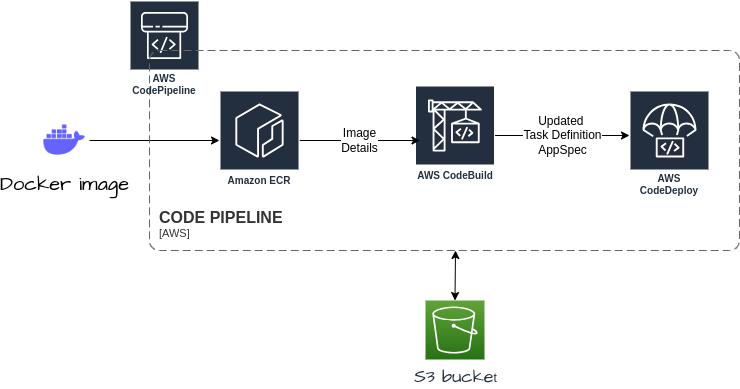

# Terraform Infrastructure as Code (IaC) for AWS ECS Blue/Green Deployment

This Terraform project automates the setup of an AWS ECS (Elastic Container Service) Blue/Green deployment pipeline with the following components and tasks:

## 1. Configure CodeBuild Project
   - Defines a CodeBuild project with source settings, buildspec file, environment variables, and Docker image configuration.
   - Specifies build steps to update the ECS Task Definition with the new ECR image URI.


## 2. Set Up CodePipeline

1. **Source Stage**: The source stage of the CodePipeline is configured to fetch code from your ECR repository.

2. **Build Stage**: This stage triggers the CodeBuild project defined earlier, which builds and pushes the Docker image to ECR.

3. **Deploy Stage**: The deploy stage sets up the ECS Task Definition using the `AppSpec.yaml` and  `Build.yaml` files. Make sure that the task definition contains the updated image URI.

## Define ECS Task Definition

- Uses the `BuildSpec.yaml`  file to define the ECS task definition.
- Ensures that the task definition contains the updated image URI from the ECR repository.

## Configure Blue/Green Deployment in CodeDeploy

 **CodeDeploy Deployment Group**:
   - Sets up a CodeDeploy deployment group using the `aws_codedeploy_deployment_group` resource.
   - Specifies ECS service, task definition, and deployment settings.
   - Configures blue/green deployment settings, including termination and timeout options.
   - Sets traffic routing via the target group.

## Manual Image Push to ECR

To trigger the deployment process:

   - Manually build and push the desired Docker image to your ECR repository. You can use the following commands as a starting point:

```sh
# Authenticate Docker with your AWS ECR repository (ensure AWS CLI is configured)
aws ecr get-login-password --region <REGION> | docker login --username AWS --password-stdin <AWS_ACCOUNT_ID>.dkr.ecr.<REGION>.amazonaws.com

# Build your Docker image (customize the Dockerfile and image tag)
docker build -t <REPOSITORY_NAME>:<TAG> .

# Tag the Docker image with the ECR repository information
docker tag <REPOSITORY_NAME>:<TAG> <AWS_ACCOUNT_ID>.dkr.ecr.<REGION>.amazonaws.com/<REPOSITORY_NAME>:<TAG>

# Push the Docker image to ECR
docker push <AWS_ACCOUNT_ID>.dkr.ecr.<REGION>.amazonaws.com/<REPOSITORY_NAME>:<TAG>
```
## Prerequisites

Before using this Terraform project, make sure you have:

- AWS credentials and appropriate permissions.
- Docker image(s) for your application hosted in an ECR repository.
- Terraform CLI installed locally.

## Usage

1. Clone this repository to your local machine.

2. Modify the `variables.tf` file to provide your specific configuration values.

3. Initialize the Terraform project:

   ```bash
   terraform init
   ```
4. Apply the Terraform plan to create the infrastructure:

   ```bash
   terraform apply
   ```

5. Follow the manual steps to push your desired Docker image to the ECR repository to trigger the deployment process.

6. Monitor the CodePipeline for the automated deployment process.

7. Once the deployment is successful, your ECS service will be updated with the new image.

## Cleanup

To clean up and destroy the created resources:

```bash
terraform destroy
```

## Notes

- Ensure you have the necessary IAM roles and permissions for CodePipeline, CodeBuild, CodeDeploy, ECS, and ECR.
- Customize the variables in `variables.tf` to match your specific environment and application requirements.

For more details and configurations, please refer to the Terraform documentation and AWS documentation for CodePipeline, CodeBuild, CodeDeploy, ECS, and ECR.

## Architecture Diagram


## Requirements

| Name | Version |
|------|---------|
| <a name="requirement_terraform"></a> [terraform](#requirement\_terraform) | >= 1.0 |
| <a name="requirement_aws"></a> [aws](#requirement\_aws) | >= 4.9 |

## Providers

| Name | Version |
|------|---------|
| <a name="provider_aws"></a> [aws](#provider\_aws) | 5.13.0 |

## Modules

No modules.

## Resources

| Name | Type |
|------|------|
| [aws_acm_certificate.my_certificate](https://registry.terraform.io/providers/hashicorp/aws/latest/docs/resources/acm_certificate) | resource |
| [aws_acm_certificate_validation.my_certificate_validation](https://registry.terraform.io/providers/hashicorp/aws/latest/docs/resources/acm_certificate_validation) | resource |
| [aws_appautoscaling_policy.ecs_policy](https://registry.terraform.io/providers/hashicorp/aws/latest/docs/resources/appautoscaling_policy) | resource |
| [aws_appautoscaling_target.ecs_target](https://registry.terraform.io/providers/hashicorp/aws/latest/docs/resources/appautoscaling_target) | resource |
| [aws_cloudwatch_event_rule.image_push](https://registry.terraform.io/providers/hashicorp/aws/latest/docs/resources/cloudwatch_event_rule) | resource |
| [aws_cloudwatch_event_target.codepipeline](https://registry.terraform.io/providers/hashicorp/aws/latest/docs/resources/cloudwatch_event_target) | resource |
| [aws_cloudwatch_metric_alarm.ecs_cpu_alarm](https://registry.terraform.io/providers/hashicorp/aws/latest/docs/resources/cloudwatch_metric_alarm) | resource |
| [aws_codebuild_project.api_codebuild_project](https://registry.terraform.io/providers/hashicorp/aws/latest/docs/resources/codebuild_project) | resource |
| [aws_codedeploy_app.codedeploy_app](https://registry.terraform.io/providers/hashicorp/aws/latest/docs/resources/codedeploy_app) | resource |
| [aws_codedeploy_deployment_group.my_deployment_group](https://registry.terraform.io/providers/hashicorp/aws/latest/docs/resources/codedeploy_deployment_group) | resource |
| [aws_codepipeline.my_app_pipeline](https://registry.terraform.io/providers/hashicorp/aws/latest/docs/resources/codepipeline) | resource |
| [aws_cognito_user_pool.user_pool](https://registry.terraform.io/providers/hashicorp/aws/latest/docs/resources/cognito_user_pool) | resource |
| [aws_cognito_user_pool_client.client](https://registry.terraform.io/providers/hashicorp/aws/latest/docs/resources/cognito_user_pool_client) | resource |
| [aws_db_instance.rds_instance](https://registry.terraform.io/providers/hashicorp/aws/latest/docs/resources/db_instance) | resource |
| [aws_db_subnet_group.rds_subnet_group](https://registry.terraform.io/providers/hashicorp/aws/latest/docs/resources/db_subnet_group) | resource |
| [aws_ecs_cluster.ecs_cluster](https://registry.terraform.io/providers/hashicorp/aws/latest/docs/resources/ecs_cluster) | resource |
| [aws_ecs_service.api_service](https://registry.terraform.io/providers/hashicorp/aws/latest/docs/resources/ecs_service) | resource |
| [aws_ecs_task_definition.api_task](https://registry.terraform.io/providers/hashicorp/aws/latest/docs/resources/ecs_task_definition) | resource |
| [aws_eip.eip_a](https://registry.terraform.io/providers/hashicorp/aws/latest/docs/resources/eip) | resource |
| [aws_iam_policy.codebuild_policies](https://registry.terraform.io/providers/hashicorp/aws/latest/docs/resources/iam_policy) | resource |
| [aws_iam_policy.codedeploy_policies](https://registry.terraform.io/providers/hashicorp/aws/latest/docs/resources/iam_policy) | resource |
| [aws_iam_policy.codepipeline_policies](https://registry.terraform.io/providers/hashicorp/aws/latest/docs/resources/iam_policy) | resource |
| [aws_iam_policy.cwe_policy](https://registry.terraform.io/providers/hashicorp/aws/latest/docs/resources/iam_policy) | resource |
| [aws_iam_policy.deploy_policies](https://registry.terraform.io/providers/hashicorp/aws/latest/docs/resources/iam_policy) | resource |
| [aws_iam_policy.ecr_policy](https://registry.terraform.io/providers/hashicorp/aws/latest/docs/resources/iam_policy) | resource |
| [aws_iam_policy.ecs_taskset_policies](https://registry.terraform.io/providers/hashicorp/aws/latest/docs/resources/iam_policy) | resource |
| [aws_iam_policy.iam_pass_policy](https://registry.terraform.io/providers/hashicorp/aws/latest/docs/resources/iam_policy) | resource |
| [aws_iam_policy_attachment.attach_deploy_policies](https://registry.terraform.io/providers/hashicorp/aws/latest/docs/resources/iam_policy_attachment) | resource |
| [aws_iam_policy_attachment.attach_esc_task_policies](https://registry.terraform.io/providers/hashicorp/aws/latest/docs/resources/iam_policy_attachment) | resource |
| [aws_iam_policy_attachment.attach_iam_pass_policy](https://registry.terraform.io/providers/hashicorp/aws/latest/docs/resources/iam_policy_attachment) | resource |
| [aws_iam_policy_attachment.codebuild_role_policy_attachment](https://registry.terraform.io/providers/hashicorp/aws/latest/docs/resources/iam_policy_attachment) | resource |
| [aws_iam_policy_attachment.cws_policy_attachment](https://registry.terraform.io/providers/hashicorp/aws/latest/docs/resources/iam_policy_attachment) | resource |
| [aws_iam_policy_attachment.s3_access](https://registry.terraform.io/providers/hashicorp/aws/latest/docs/resources/iam_policy_attachment) | resource |
| [aws_iam_role.codebuild_role](https://registry.terraform.io/providers/hashicorp/aws/latest/docs/resources/iam_role) | resource |
| [aws_iam_role.codedeploy_role](https://registry.terraform.io/providers/hashicorp/aws/latest/docs/resources/iam_role) | resource |
| [aws_iam_role.codepipeline_role](https://registry.terraform.io/providers/hashicorp/aws/latest/docs/resources/iam_role) | resource |
| [aws_iam_role.cwe_role](https://registry.terraform.io/providers/hashicorp/aws/latest/docs/resources/iam_role) | resource |
| [aws_iam_role.ecs_execution_role](https://registry.terraform.io/providers/hashicorp/aws/latest/docs/resources/iam_role) | resource |
| [aws_iam_role_policy_attachment.codebuild_policies_attachment](https://registry.terraform.io/providers/hashicorp/aws/latest/docs/resources/iam_role_policy_attachment) | resource |
| [aws_iam_role_policy_attachment.codedeploy_policies_attachment](https://registry.terraform.io/providers/hashicorp/aws/latest/docs/resources/iam_role_policy_attachment) | resource |
| [aws_iam_role_policy_attachment.codepipeline_policies_attachment](https://registry.terraform.io/providers/hashicorp/aws/latest/docs/resources/iam_role_policy_attachment) | resource |
| [aws_iam_role_policy_attachment.ecs_execution_role_attachment](https://registry.terraform.io/providers/hashicorp/aws/latest/docs/resources/iam_role_policy_attachment) | resource |
| [aws_iam_role_policy_attachment.ecs_role_attachment](https://registry.terraform.io/providers/hashicorp/aws/latest/docs/resources/iam_role_policy_attachment) | resource |
| [aws_internet_gateway.igw](https://registry.terraform.io/providers/hashicorp/aws/latest/docs/resources/internet_gateway) | resource |
| [aws_lb.my_alb](https://registry.terraform.io/providers/hashicorp/aws/latest/docs/resources/lb) | resource |
| [aws_lb_listener.green_listener](https://registry.terraform.io/providers/hashicorp/aws/latest/docs/resources/lb_listener) | resource |
| [aws_lb_listener.http_listener](https://registry.terraform.io/providers/hashicorp/aws/latest/docs/resources/lb_listener) | resource |
| [aws_lb_listener.https_listener](https://registry.terraform.io/providers/hashicorp/aws/latest/docs/resources/lb_listener) | resource |
| [aws_lb_target_group.frontend_tg](https://registry.terraform.io/providers/hashicorp/aws/latest/docs/resources/lb_target_group) | resource |
| [aws_lb_target_group.green_frontend_tg](https://registry.terraform.io/providers/hashicorp/aws/latest/docs/resources/lb_target_group) | resource |
| [aws_nat_gateway.nat_gateway](https://registry.terraform.io/providers/hashicorp/aws/latest/docs/resources/nat_gateway) | resource |
| [aws_route53_record.my_validation](https://registry.terraform.io/providers/hashicorp/aws/latest/docs/resources/route53_record) | resource |
| [aws_route53_record.subdomain](https://registry.terraform.io/providers/hashicorp/aws/latest/docs/resources/route53_record) | resource |
| [aws_route_table.private_route_table](https://registry.terraform.io/providers/hashicorp/aws/latest/docs/resources/route_table) | resource |
| [aws_route_table.public_route_table](https://registry.terraform.io/providers/hashicorp/aws/latest/docs/resources/route_table) | resource |
| [aws_route_table_association.private_association_a](https://registry.terraform.io/providers/hashicorp/aws/latest/docs/resources/route_table_association) | resource |
| [aws_route_table_association.private_association_b](https://registry.terraform.io/providers/hashicorp/aws/latest/docs/resources/route_table_association) | resource |
| [aws_route_table_association.public_association_a](https://registry.terraform.io/providers/hashicorp/aws/latest/docs/resources/route_table_association) | resource |
| [aws_route_table_association.public_association_b](https://registry.terraform.io/providers/hashicorp/aws/latest/docs/resources/route_table_association) | resource |
| [aws_s3_bucket.sana-pipeline-bucket](https://registry.terraform.io/providers/hashicorp/aws/latest/docs/resources/s3_bucket) | resource |
| [aws_s3_bucket_policy.pipeline-bucket_policy](https://registry.terraform.io/providers/hashicorp/aws/latest/docs/resources/s3_bucket_policy) | resource |
| [aws_security_group.alb_sg](https://registry.terraform.io/providers/hashicorp/aws/latest/docs/resources/security_group) | resource |
| [aws_security_group.ecs_sg](https://registry.terraform.io/providers/hashicorp/aws/latest/docs/resources/security_group) | resource |
| [aws_security_group.rds_sg](https://registry.terraform.io/providers/hashicorp/aws/latest/docs/resources/security_group) | resource |
| [aws_subnet.private_subnet_a](https://registry.terraform.io/providers/hashicorp/aws/latest/docs/resources/subnet) | resource |
| [aws_subnet.private_subnet_b](https://registry.terraform.io/providers/hashicorp/aws/latest/docs/resources/subnet) | resource |
| [aws_subnet.public_subnet_a](https://registry.terraform.io/providers/hashicorp/aws/latest/docs/resources/subnet) | resource |
| [aws_subnet.public_subnet_b](https://registry.terraform.io/providers/hashicorp/aws/latest/docs/resources/subnet) | resource |
| [aws_vpc.custom_vpc](https://registry.terraform.io/providers/hashicorp/aws/latest/docs/resources/vpc) | resource |
| [aws_ecr_repository.existing_repo](https://registry.terraform.io/providers/hashicorp/aws/latest/docs/data-sources/ecr_repository) | data source |
| [aws_route53_zone.hosted_zone](https://registry.terraform.io/providers/hashicorp/aws/latest/docs/data-sources/route53_zone) | data source |

## Inputs

| Name | Description | Type | Default | Required |
|------|-------------|------|---------|:--------:|
| <a name="input_Postgres_port"></a> [Postgres\_port](#input\_Postgres\_port) | Allows postgres port | `string` | `5432` | no |
| <a name="input_alb_internal"></a> [alb\_internal](#input\_alb\_internal) | Sets Alb to internal | `string` | `"false"` | no |
| <a name="input_alb_name"></a> [alb\_name](#input\_alb\_name) | Name of the Application Load Balanacer | `string` | `"api-alb"` | no |
| <a name="input_all_cidr"></a> [all\_cidr](#input\_all\_cidr) | Cidr Block allowing all Ip's | `string` | `"0.0.0.0/0"` | no |
| <a name="input_all_ports"></a> [all\_ports](#input\_all\_ports) | Allows all ports | `number` | `0` | no |
| <a name="input_appspec_name"></a> [appspec\_name](#input\_appspec\_name) | App Spec File Name | `string` | `"imagedefinitions.json"` | no |
| <a name="input_availability_zone_a"></a> [availability\_zone\_a](#input\_availability\_zone\_a) | Availability Zone for Public Subnet A | `string` | `"ap-southeast-1a"` | no |
| <a name="input_availability_zone_b"></a> [availability\_zone\_b](#input\_availability\_zone\_b) | Availability Zone for Public Subnet B | `string` | `"ap-southeast-1b"` | no |
| <a name="input_backend_container_name"></a> [backend\_container\_name](#input\_backend\_container\_name) | Name of the backend container | `string` | `"backend_container"` | no |
| <a name="input_backend_tg_name"></a> [backend\_tg\_name](#input\_backend\_tg\_name) | Name for the backend target group | `string` | `"backend-tg"` | no |
| <a name="input_buildspec_file"></a> [buildspec\_file](#input\_buildspec\_file) | Buld Spec File Name | `string` | `"buildspec.yaml"` | no |
| <a name="input_codebuild_configuration"></a> [codebuild\_configuration](#input\_codebuild\_configuration) | Codebuild Congiguration Details | `map(string)` | <pre>{<br>  "cb_compute_type": "BUILD_GENERAL1_SMALL",<br>  "cb_image": "aws/codebuild/standard:5.0",<br>  "cb_type": "LINUX_CONTAINER"<br>}</pre> | no |
| <a name="input_codebuild_project_name"></a> [codebuild\_project\_name](#input\_codebuild\_project\_name) | Name of CodeBuildProject | `string` | `"api-codebuild-project"` | no |
| <a name="input_codedeploy_app_name"></a> [codedeploy\_app\_name](#input\_codedeploy\_app\_name) | Name of the AWS CodeDeploy application | `string` | `"codeapp"` | no |
| <a name="input_codedeploy_compute_platform"></a> [codedeploy\_compute\_platform](#input\_codedeploy\_compute\_platform) | Compute platform for the AWS CodeDeploy application | `string` | `"ECS"` | no |
| <a name="input_codepipeline_artifacts"></a> [codepipeline\_artifacts](#input\_codepipeline\_artifacts) | CodePipeline Atrifacts Names | `map(string)` | <pre>{<br>  "build": "BuildA",<br>  "source": "source"<br>}</pre> | no |
| <a name="input_codepipeline_name"></a> [codepipeline\_name](#input\_codepipeline\_name) | Name of CodePipeline | `string` | `"my-app-pipeline"` | no |
| <a name="input_codepipeline_owner"></a> [codepipeline\_owner](#input\_codepipeline\_owner) | Owner name of CodePipeline | `string` | `"AWS"` | no |
| <a name="input_codepipeline_stages"></a> [codepipeline\_stages](#input\_codepipeline\_stages) | CodePipeline Stages Names | `map(string)` | <pre>{<br>  "build": "Build",<br>  "deploy": "Deploy",<br>  "source": "Source"<br>}</pre> | no |
| <a name="input_cognito_client_name"></a> [cognito\_client\_name](#input\_cognito\_client\_name) | Name of the Cognito User Pool Client | `string` | `"cognito-client"` | no |
| <a name="input_custom_port_1"></a> [custom\_port\_1](#input\_custom\_port\_1) | Custom port 1 | `number` | `3000` | no |
| <a name="input_custom_port_2"></a> [custom\_port\_2](#input\_custom\_port\_2) | Custom port 2 | `number` | `5000` | no |
| <a name="input_db_name"></a> [db\_name](#input\_db\_name) | Name of the RDS database | `string` | `"restapi"` | no |
| <a name="input_db_password"></a> [db\_password](#input\_db\_password) | Password for the RDS database | `string` | `"postgres"` | no |
| <a name="input_db_subnet_group_name"></a> [db\_subnet\_group\_name](#input\_db\_subnet\_group\_name) | Name for the AWS RDS subnet group | `string` | `"rds-subnet"` | no |
| <a name="input_db_username"></a> [db\_username](#input\_db\_username) | Username for the RDS database | `string` | `"postgres"` | no |
| <a name="input_deployment_congif"></a> [deployment\_congif](#input\_deployment\_congif) | Deployment Configuration | `string` | `"CodeDeployDefault.ECSAllAtOnce"` | no |
| <a name="input_deployment_group_name"></a> [deployment\_group\_name](#input\_deployment\_group\_name) | Name of CodeDeploy Deployment Group | `string` | `"devgroup"` | no |
| <a name="input_deployment_sucess_timeout"></a> [deployment\_sucess\_timeout](#input\_deployment\_sucess\_timeout) | termination time after sucessful deployment | `number` | `5` | no |
| <a name="input_deployment_type"></a> [deployment\_type](#input\_deployment\_type) | Type of Deployment | `string` | `"BLUE_GREEN"` | no |
| <a name="input_domain_name"></a> [domain\_name](#input\_domain\_name) | The root domain name | `string` | `"bootcamp1.xgrid.co"` | no |
| <a name="input_ecr_iam_policy_name"></a> [ecr\_iam\_policy\_name](#input\_ecr\_iam\_policy\_name) | Name for the AWS IAM policy for ECR | `string` | `"ecr_policy"` | no |
| <a name="input_ecr_repository_name"></a> [ecr\_repository\_name](#input\_ecr\_repository\_name) | Name of the existing AWS ECR repository | `string` | `"my_ecr_repo"` | no |
| <a name="input_ecs_cluster_name"></a> [ecs\_cluster\_name](#input\_ecs\_cluster\_name) | Name of the ECS cluster | `string` | `"my-ecs-cluster"` | no |
| <a name="input_ecs_cpu"></a> [ecs\_cpu](#input\_ecs\_cpu) | CPU value for ECS task | `string` | `"1024"` | no |
| <a name="input_ecs_iam_role_name"></a> [ecs\_iam\_role\_name](#input\_ecs\_iam\_role\_name) | Name for the AWS IAM role for ECS | `string` | `"ecs_execution_role"` | no |
| <a name="input_ecs_memory"></a> [ecs\_memory](#input\_ecs\_memory) | Memory value for ECS task | `string` | `"2048"` | no |
| <a name="input_ecs_network_mode"></a> [ecs\_network\_mode](#input\_ecs\_network\_mode) | Network mode for ECS task | `string` | `"awsvpc"` | no |
| <a name="input_ecs_service_name"></a> [ecs\_service\_name](#input\_ecs\_service\_name) | Name for the AWS ECS service | `string` | `"api-service"` | no |
| <a name="input_ecs_task_family"></a> [ecs\_task\_family](#input\_ecs\_task\_family) | Family name for the AWS ECS task definition | `string` | `"api-task"` | no |
| <a name="input_enable_deletion_protection"></a> [enable\_deletion\_protection](#input\_enable\_deletion\_protection) | Opption for enabling deletion protection | `string` | `"false"` | no |
| <a name="input_front_tg_name"></a> [front\_tg\_name](#input\_front\_tg\_name) | Name for the frontend target group | `string` | `"frontend-tg"` | no |
| <a name="input_frontend_container_name"></a> [frontend\_container\_name](#input\_frontend\_container\_name) | Name of the frontend container | `string` | `"frontend_container"` | no |
| <a name="input_green_target_group_name"></a> [green\_target\_group\_name](#input\_green\_target\_group\_name) | Name for the green target group | `string` | `"green-frontend-tg"` | no |
| <a name="input_http_port"></a> [http\_port](#input\_http\_port) | HTTP port | `number` | `80` | no |
| <a name="input_https_port"></a> [https\_port](#input\_https\_port) | HTTPS port | `number` | `443` | no |
| <a name="input_image_tag"></a> [image\_tag](#input\_image\_tag) | Image tag for the ECS task definition | `string` | `"blue"` | no |
| <a name="input_load_balancer_type"></a> [load\_balancer\_type](#input\_load\_balancer\_type) | Load Balancer Type | `string` | `"application"` | no |
| <a name="input_private_subnet_a_cidr"></a> [private\_subnet\_a\_cidr](#input\_private\_subnet\_a\_cidr) | CIDR block for Private Subnet A | `string` | `"10.0.2.0/24"` | no |
| <a name="input_private_subnet_b_cidr"></a> [private\_subnet\_b\_cidr](#input\_private\_subnet\_b\_cidr) | CIDR block for Private Subnet B | `string` | `"10.0.4.0/24"` | no |
| <a name="input_protocol_http"></a> [protocol\_http](#input\_protocol\_http) | HTTP protocol | `string` | `"http"` | no |
| <a name="input_protocol_tcp"></a> [protocol\_tcp](#input\_protocol\_tcp) | TCP protocol | `string` | `"tcp"` | no |
| <a name="input_public_subnet_a_cidr"></a> [public\_subnet\_a\_cidr](#input\_public\_subnet\_a\_cidr) | CIDR block for Public Subnet A | `string` | `"10.0.1.0/24"` | no |
| <a name="input_public_subnet_b_cidr"></a> [public\_subnet\_b\_cidr](#input\_public\_subnet\_b\_cidr) | CIDR block for Public Subnet B | `string` | `"10.0.3.0/24"` | no |
| <a name="input_rds_identifier"></a> [rds\_identifier](#input\_rds\_identifier) | Identifier for the RDS instance | `string` | `"rds-instance"` | no |
| <a name="input_rds_instance_class"></a> [rds\_instance\_class](#input\_rds\_instance\_class) | RDS instance class | `string` | `"db.t3.micro"` | no |
| <a name="input_s3_bucket"></a> [s3\_bucket](#input\_s3\_bucket) | Name of S3Bucket | `string` | `"sana-pipeline-bucket"` | no |
| <a name="input_sg_name_alb"></a> [sg\_name\_alb](#input\_sg\_name\_alb) | Prefix for the AWS security group name for Alb | `string` | `"alb-sg"` | no |
| <a name="input_sg_name_ecs"></a> [sg\_name\_ecs](#input\_sg\_name\_ecs) | Prefix for the AWS security group name for Ecs | `string` | `"ecs-sg"` | no |
| <a name="input_sg_name_rds"></a> [sg\_name\_rds](#input\_sg\_name\_rds) | Prefix for the AWS security group name for Rds | `string` | `"rds-sg"` | no |
| <a name="input_source_imgtag"></a> [source\_imgtag](#input\_source\_imgtag) | ImageTag for Codepipeline Source Stage | `string` | `"green"` | no |
| <a name="input_ssh_port"></a> [ssh\_port](#input\_ssh\_port) | SSH port | `number` | `22` | no |
| <a name="input_subdomain_name"></a> [subdomain\_name](#input\_subdomain\_name) | The subdomain name | `string` | `"sana.bootcamp1.xgrid.co"` | no |
| <a name="input_tags"></a> [tags](#input\_tags) | Common tags to apply to resources | `map(string)` | <pre>{<br>  "Creator": "Sana Rahman",<br>  "Name": "Default_Name",<br>  "Project": "Sprint 3"<br>}</pre> | no |
| <a name="input_target_type"></a> [target\_type](#input\_target\_type) | Type of target for the target group | `string` | `"ip"` | no |
| <a name="input_taskdef_name"></a> [taskdef\_name](#input\_taskdef\_name) | Updated Task Defination File Name | `string` | `"imagedefinitions.json"` | no |
| <a name="input_user_pool_name"></a> [user\_pool\_name](#input\_user\_pool\_name) | Name of the Cognito User Pool | `string` | `"user-pool"` | no |
| <a name="input_vpc_cidr_block"></a> [vpc\_cidr\_block](#input\_vpc\_cidr\_block) | CIDR block for the VPC | `string` | `"10.0.0.0/16"` | no |

## Outputs

| Name | Description |
|------|-------------|
| <a name="output_backend_task_definition"></a> [backend\_task\_definition](#output\_backend\_task\_definition) | ARN of the backend ECS task definition |
| <a name="output_codebuild_project_name"></a> [codebuild\_project\_name](#output\_codebuild\_project\_name) | The name of the CodeBuild project |
| <a name="output_codedeploy_app_name"></a> [codedeploy\_app\_name](#output\_codedeploy\_app\_name) | The name of the CodeDeploy application |
| <a name="output_codedeploy_deployment_group_name"></a> [codedeploy\_deployment\_group\_name](#output\_codedeploy\_deployment\_group\_name) | The name of the CodeDeploy deployment group |
| <a name="output_codepipeline_name"></a> [codepipeline\_name](#output\_codepipeline\_name) | The name of the CodePipeline |
| <a name="output_ecr_repo_url"></a> [ecr\_repo\_url](#output\_ecr\_repo\_url) | n/a |
| <a name="output_ecs_cluster_name"></a> [ecs\_cluster\_name](#output\_ecs\_cluster\_name) | Name of the ECS Cluster |
| <a name="output_frontend_task_definition"></a> [frontend\_task\_definition](#output\_frontend\_task\_definition) | ARN of the frontend ECS task definition |
| <a name="output_load_balancer_dns_name"></a> [load\_balancer\_dns\_name](#output\_load\_balancer\_dns\_name) | DNS name of the Application Load Balancer |
| <a name="output_nat_gateway_ip"></a> [nat\_gateway\_ip](#output\_nat\_gateway\_ip) | Elastic IP address of the NAT Gateway |
| <a name="output_private_subnet_ids"></a> [private\_subnet\_ids](#output\_private\_subnet\_ids) | IDs of the Private Subnets |
| <a name="output_public_subnet_ids"></a> [public\_subnet\_ids](#output\_public\_subnet\_ids) | IDs of the Public Subnets |
| <a name="output_rds_instance_endpoint"></a> [rds\_instance\_endpoint](#output\_rds\_instance\_endpoint) | Endpoint address of the RDS instance |
| <a name="output_rds_instance_id"></a> [rds\_instance\_id](#output\_rds\_instance\_id) | ID of the RDS instance |
| <a name="output_s3_bucket_name"></a> [s3\_bucket\_name](#output\_s3\_bucket\_name) | The name of the S3 bucket for pipeline artifacts |
| <a name="output_user_pool_client_id"></a> [user\_pool\_client\_id](#output\_user\_pool\_client\_id) | ID of the AWS Cognito User Pool Client |
| <a name="output_user_pool_id"></a> [user\_pool\_id](#output\_user\_pool\_id) | ID of the AWS Cognito User Pool |
| <a name="output_vpc_id"></a> [vpc\_id](#output\_vpc\_id) | ID of the VPC |
